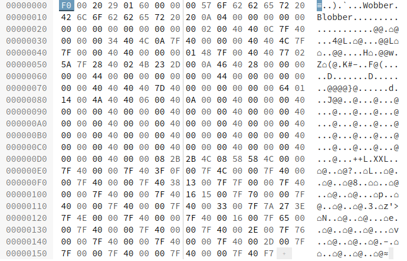

Thanks to the adding of patch editor in the web Novation Circuit Component, this project is no longer relevant and no longer active.

# Circuit Web Synth Editor

Circuit Web Synth Editor is a Free/Libre web application to edit patches on the Novation Circuit.

It works offline but need a browser compatible with WebMidi API.

The purpose of this project is to cover my personal needs by avoiding the use of other editors not compatible with GNU/Linux.

It can edit an existing patch on the circuit, create new ones and export to Sysex file compatible with Novation Component.

# License

This application is published under the GPL3 license.

# Terms of use

I can not be held liable for material damage, loss of data or any other inconvenience resulting from the use of this software. **Use it at your own risk**.

# Installation & usage

- Clone this repository or download and extract a zipped release.
- Plug in the Circuit USB.
- Open the html file with one supported browser.
- If the connection is successful, *Connected* appears in green on the screen and a short sound is played by the Circuit.

You always have to connect the Circuit first or must reload the page after the plug in.

# Troubleshootings

- Avoid using any other software connected to the Circuit at the same time as you edit a buffered patch in Circuit Web Synth Editor (such as Novation Component or the Isotonik Editor): there may be unwanted behavior in the editor ruining your current edition.
- If the Circuit freezes for some reason, unplug USB wire.

[You can report any problems](https://framagit.org/pumpkin/circuit-web-synth-editor/issues).

# Libraries

Circuit Web Synth Editor uses:

- Bootstrap 4.0.0-beta and its dependencies (jquery, popper).
- FileSaver.js
- WebMidi.js

# Documentation

See the [Novation Circuit PDF specs](resources/circuit-programmers-reference-guide-v1-0.pdf).

## Patch

Patch file example:

#### LFO

Params values **0:122** and **0:123** are grouped on **0x0000003B** for *LFO1* and **0x00000044** for *LFO2*

Values of **0:122** and **0:123** are added to be stored on these slots.

Here are the mapping:

| LFO | Parameter     | Control # | CC values | Patch values |
| ----| ------------- | --------- | --------- | ------------ |
| 1   | Fade Mode     | 0:123     | 0         | 0            |
| 1   | Fade Mode     | 0:123     | 1         | 16           |
| 1   | Fade Mode     | 0:123     | 2         | 32           |
| 1   | Fade Mode     | 0:123     | 3         | 48           |
| 1   | One shot      | 0:122     | 12        | 0            |
| 1   | One shot      | 0:122     | 13        | 1            |
| 1   | Key sync      | 0:122     | 14        | 0            |
| 1   | Key sync      | 0:122     | 15        | 2            |
| 1   | Common sync   | 0:122     | 16        | 0            |
| 1   | Common sync   | 0:122     | 17        | 4            |
| 1   | Delay trigger | 0:122     | 18        | 0            |
| 1   | Delay trigger | 0:122     | 19        | 8            |

| LFO | Parameter     | Control # | CC values | Patch values |
| ----| ------------- | --------- | --------- | ------------ |
| 2   | Fade Mode     | 0:123     | 4         | 0            |
| 2   | Fade Mode     | 0:123     | 5         | 16           |
| 2   | Fade Mode     | 0:123     | 6         | 32           |
| 2   | Fade Mode     | 0:123     | 7         | 48           |
| 2   | One shot      | 0:122     | 22        | 0            |
| 2   | One shot      | 0:122     | 23        | 1            |
| 2   | Key sync      | 0:122     | 24        | 0            |
| 2   | Key sync      | 0:122     | 25        | 2            |
| 2   | Common sync   | 0:122     | 26        | 0            |
| 2   | Common sync   | 0:122     | 27        | 4            |
| 2   | Delay trigger | 0:122     | 28        | 0            |
| 2   | Delay trigger | 0:122     | 29        | 8            |

So for example:

- If **0x0000003B** value is decimal **51** (Patch values 48 + 2 + 1) the following CC values are selected:

  LFO 1 Fade Mode 3 / LFO 1 Key sync 15 / LFO 1 One shot 13.

  The others CC values are 0.

- If **0x00000044** value is decimal **42** (Patch values 32 + 8 + 2) the following CC values are selected:

  LFO 2 Fade Mode 6 / LFO 2 Delay trigger 29 / LFO 2 Key sync 25.

  The others CC values are 0.

## Session

| Position  | Type of data                                         | Values (dec) |
| --------- | ---------------------------------------------------- | ------------ |
| 0x6EE6    | Index position of the patch slot selected by synth 1 | 0 to 63      |
| 0x6EEF    | Index position of the patch slot selected by synth 2 | 0 to 63      |
| 0xDBBD    | Index position of the sample slot selected by drum 1 | 0 to 63      |
| 0xDBC6    | Index position of the sample slot selected by drum 2 | 0 to 63      |
| 0xDBCF    | Index position of the sample slot selected by drum 3 | 0 to 63      |
| 0xDBD8    | Index position of the sample slot selected by drum 4 | 0 to 63      |
